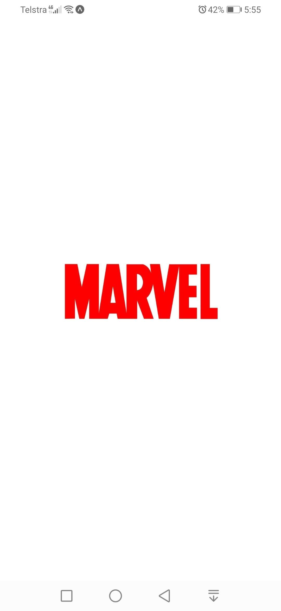
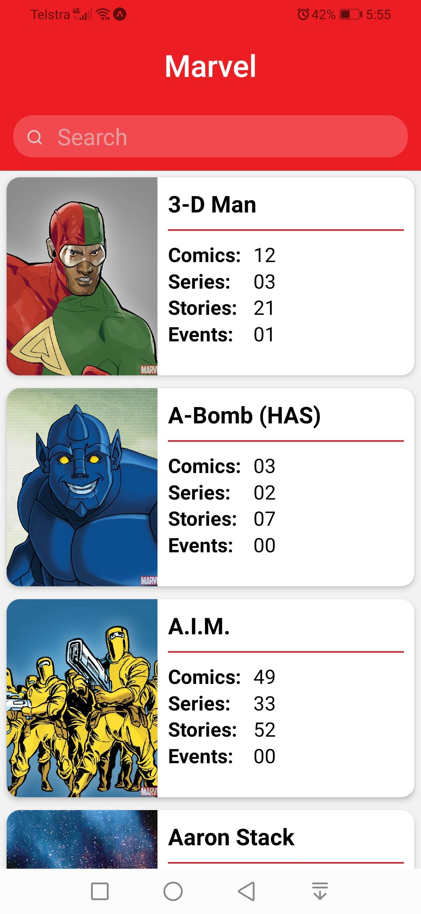
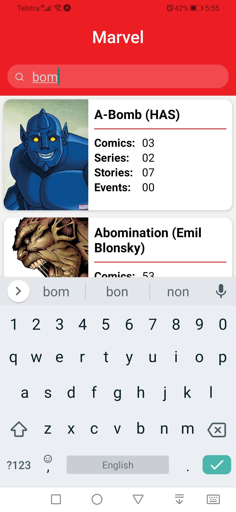
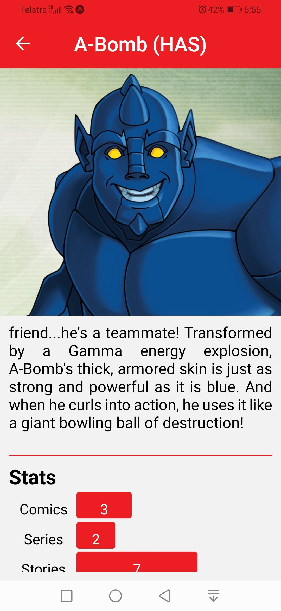

# Marvel

## Install

- Add Api Keys

> this project require marvel api keys to run, generate yours [here](https://developer.marvel.com/account)

Create a file named `params.json` in the root directory of this project  
Add the following in that file:-

```json
{
  "marvel_private_key": "*** private key ***",
  "marvel_public_key": "*** public key ***"
}
```

- Install dependencies

```
npm i
```

- Run

```
npm start
```

## Screenshots



  

